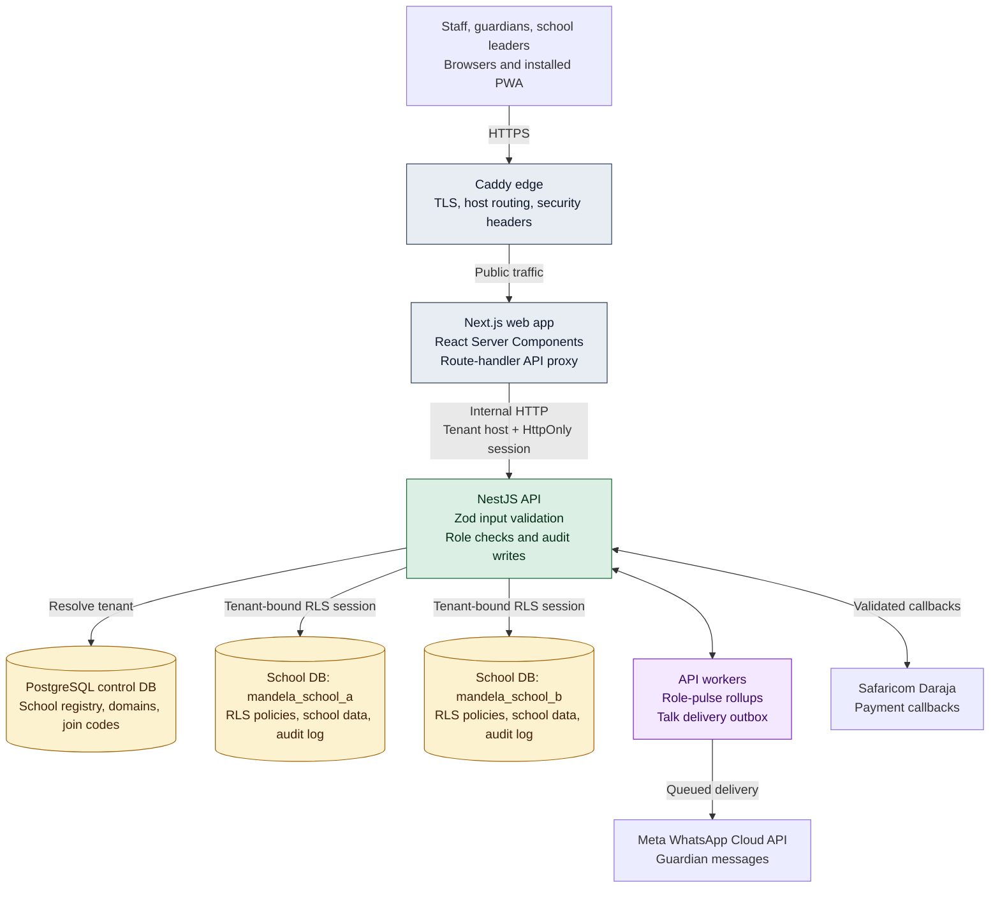
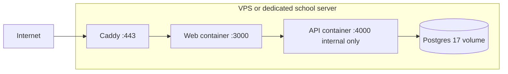

# Mandela architecture map

## Request path

1. Browser reaches Caddy over HTTPS.
2. Caddy forwards public traffic only to Next.js; public direct API hostname returns 404.
3. Next.js proxies data requests to the API with a resolved tenant host and browser session cookie.
4. API resolves tenant in the control database, validates the tenant-bound session, then opens the matching school database.
5. PostgreSQL row-level security limits each request to its permitted rows.
6. API writes audit records and workers process rollups or queued outbound messages.

## Isolation boundary

- Control DB holds platform registry only. It does not hold school operational data.
- Each school has its own database and migration history.
- A session issued for one tenant fails validation for every other tenant.
- RLS is a second boundary inside each school database.

## Deployment shape

## Current gaps

- Sessions expire after 12 hours but are not yet server-side revocable.
- Production OTP transport must be completed before guardian OTP login can ship.
